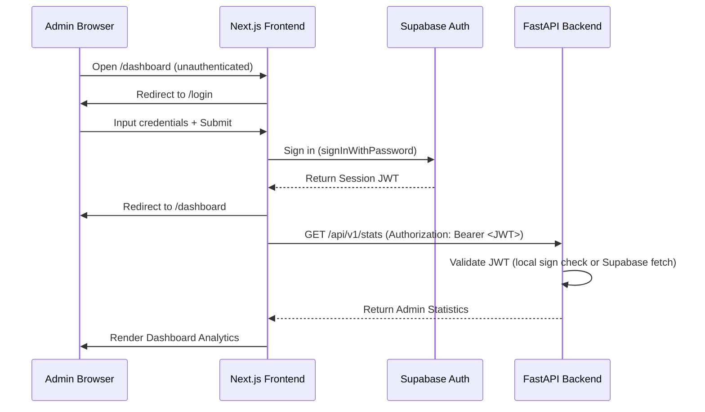

# Procare Console — Phase 1 Foundation

The **Procare Console** is a secure administration portal for managing the existing Procare System. This repository houses the foundation of the console, separated cleanly into frontend and backend applications.

---

## Project Structure

```text
procare-console/
│
├── frontend/             # Next.js App Router (TypeScript, Tailwind CSS)
│   ├── src/
│   │   ├── app/          # Navigation routes (/login, /dashboard, /users, etc.)
│   │   ├── context/      # Authentication state and navigation protection
│   │   └── lib/          # Supabase client helper
│   ├── .env.example      # Frontend variables template
│   └── package.json      # Frontend package configuration
│
└── backend/              # Python FastAPI REST API
    ├── app/
    │   ├── main.py       # API entrypoint, CORS configuration
    │   ├── config.py     # Pydantic Settings validator
    │   ├── auth.py       # JWT verification backend dependency
    │   └── routes/       # API router controllers (/health, /stats)
    ├── .env.example      # Backend secrets template
    └── requirements.txt  # Python packages list
```

---

## Setup & Configuration

### 1. Database Connections (Supabase)
Both applications leverage the existing Supabase project. For testing, the client setups boot gracefully with mock endpoint keys, but for production, they connect directly to the shared Supabase.

### 2. Environment Variables

Create `.env` files in both directories according to their respective `.env.example` templates.

#### Frontend (`frontend/.env`)
Create `procare-console/frontend/.env`:
```env
NEXT_PUBLIC_SUPABASE_URL=https://your-supabase-project.supabase.co
NEXT_PUBLIC_SUPABASE_ANON_KEY=your-supabase-anon-public-key
NEXT_PUBLIC_API_URL=http://localhost:8001/api/v1
```
*Note: The frontend must never contain the `SUPABASE_SERVICE_ROLE_KEY`.*

#### Backend (`backend/.env`)
Create `procare-console/backend/.env`:
```env
SUPABASE_URL=https://your-supabase-project.supabase.co
SUPABASE_ANON_KEY=your-supabase-anon-public-key
SUPABASE_SERVICE_ROLE_KEY=your-supabase-service-role-private-key
SUPABASE_JWT_SECRET=your-supabase-jwt-secret
```
*Note: Keep the backend `.env` file out of all public branches. The `.gitignore` files are pre-configured to block pushing secrets.*

---

## Running the Applications

### Starting the Backend

1. Navigate to the backend directory:
   ```bash
   cd procare-console/backend
   ```
2. Activate the virtual environment:
   * **Windows Powershell:**
     ```powershell
     .venv\Scripts\Activate.ps1
     ```
   * **macOS/Linux:**
     ```bash
     source .venv/bin/activate
     ```
3. Install dependencies:
   ```bash
   pip install -r requirements.txt
   ```
4. Run the development server:
   ```bash
   python -m uvicorn app.main:app --reload --port 8001
   ```
   * The API starts at: [http://localhost:8001](http://localhost:8001)
   * Check API health: [http://localhost:8001/health](http://localhost:8001/health)

### Starting the Frontend

1. Navigate to the frontend directory:
   ```bash
   cd procare-console/frontend
   ```
2. Install dependencies:
   ```bash
   npm install
   ```
3. Start the hot-reloading dev server:
   ```bash
   npm run dev
   ```
   * The frontend starts at: [http://localhost:3001](http://localhost:3001)

---

## Authentication & Security Flow



### Security Highlights
* **Route Protection:** Handled client-side by `AuthProvider`. Attempts to access `/dashboard` or other pages while unauthenticated redirect to `/login`.
* **Privileged Keys:** `SUPABASE_SERVICE_ROLE_KEY` is hosted exclusively on the Python backend server. It is never prefix-loaded or exposed to browser logs.
* **Backend JWT Audits:** API routes read client tokens via `HTTPBearer` and verify signatures locally using the `SUPABASE_JWT_SECRET` (or via the Supabase Auth API as a fallback), blocking unauthorized callers.

---

## Future Phase Plans

Phase 1 establishes the architecture shell. Phase 2 will implement database CRUD behaviors:
* **Users:** Direct management of patients and healthcare staff logins.
* **Chat Logs:** Reviewing chatbot history, rating transcripts, and triage metrics.
* **Logs & Storage:** Monitoring database utilization and server log retention.
* **Gallery:** Facility media bucket file uploads and caption details.
* **Team:** Creating, updating, and ordering physician profiles.
